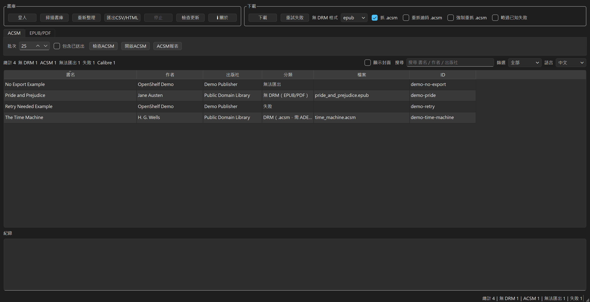
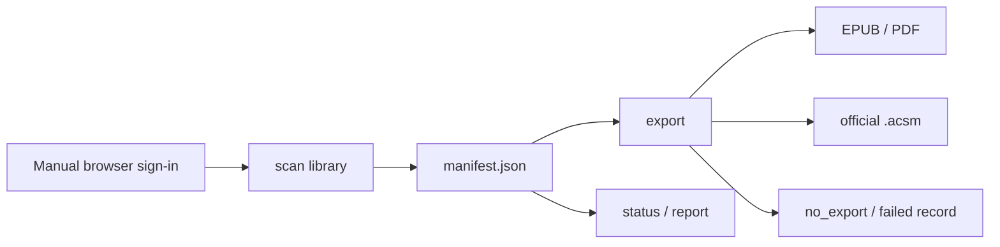

<div align="center">

# OpenShelf

**Batch-export the Google Play Books files you are legitimately allowed to export, and keep them organized on your own computer.**

DRM-free books → EPUB / PDF · protected books → official `.acsm` for Adobe Digital Editions · unavailable exports → record only

[**English**](README.en.md) ｜ [繁體中文](README.md)

[](https://github.com/SanHsien/openshelf/releases/latest)
[](https://github.com/SanHsien/openshelf/actions/workflows/ci.yml)
[](https://www.python.org/)
[](#platform-support)
[](LICENSE)

[Download latest release](https://github.com/SanHsien/openshelf/releases/latest) · [Run from source](#run-from-source) · [Development and tests](#development-and-tests)

</div>



OpenShelf is a local Google Play Books export tool. You sign in once in a real browser; the app then enumerates your own library, determines what Google allows to be exported, and tracks the result in a resumable manifest.

The goal is not to break ebook protection. The goal is to turn Google's existing per-book export options into a repeatable, inspectable batch workflow.

## What it does

| Book status | What OpenShelf does |
|---|---|
| Google offers EPUB / PDF | Downloads the official DRM-free file |
| Google only offers ACSM | Downloads the official `.acsm` and hands it to Adobe Digital Editions |
| Google offers no export | Records `no_export`; does not bypass the restriction |
| Download or endpoint failure | Records `failed` so it can be retried later |

Highlights:

- **Local-first**: no OpenShelf cloud account and no hosted copy of your library or files.
- **No password handling**: you complete sign-in yourself in a real browser; the program only reuses the resulting session.
- **HTTP-first after login**: library enumeration and downloads use backend requests instead of fragile DOM automation.
- **Resumable**: `manifest.json` is the local state record, so interrupted runs do not have to start over.
- **GUI + CLI**: a desktop app for normal use and an `openshelf` command for automation and diagnostics.
- **Reports and handoff**: TXT / CSV / HTML reports plus separate EPUB/PDF, ACSM, and Calibre handoff flows.

## Download and use

### Windows: use a release build

Go to [Latest Release](https://github.com/SanHsien/openshelf/releases/latest). The stable release provides a Windows installer and portable packages, with SHA-256 checksum files for major artifacts.

Typical first run:

1. **Sign in**: open the browser and sign in to your own Google account.
2. **Scan**: enumerate your Google Play Books library and build the local manifest.
3. **Export**: download permitted EPUB/PDF files or official `.acsm` files.
4. **Review**: search the result, retry failures, or export reports.

> Current Windows binaries are not Authenticode-signed, so SmartScreen may show an unknown-publisher warning. Download only from this repository's Releases and verify the SHA-256 file when appropriate.

### Run from source

Requires Python 3.11+.

```bash
git clone https://github.com/SanHsien/openshelf.git
cd openshelf
pip install -e .
```

First use:

```bash
openshelf login
openshelf scan
openshelf export
openshelf status
```

For the desktop UI:

```bash
pip install -e ".[gui]"
openshelf ui
```

Login prefers a locally installed Chrome or Edge. Playwright's bundled Chromium is only needed as a fallback.

## Workflow



Google Play Books does not provide a public "download my purchased books" API. OpenShelf isolates the current library endpoint integration in `openshelf/playbooks.py`, so a Google-side change is primarily an adapter-maintenance problem rather than a GUI rewrite.

## Common commands

| Command | Purpose |
|---|---|
| `openshelf login` | Sign in manually and save session state |
| `openshelf scan` | Enumerate the library and update the manifest |
| `openshelf export` | Download available EPUB/PDF or `.acsm` files |
| `openshelf status` | Show current counts and state |
| `openshelf report` | Produce TXT / CSV / HTML reports |
| `openshelf doctor` | Check whether the Google endpoint still matches expectations |
| `openshelf acsm-open` | Hand downloaded `.acsm` files to the default app / ADE |
| `openshelf ebook-open` | Open downloaded DRM-free EPUB/PDF files |
| `openshelf calibre-import` | Import DRM-free EPUB/PDF files into Calibre |
| `openshelf ui` | Launch the desktop UI |

See complete options with:

```bash
openshelf --help
openshelf export --help
```

Common examples:

```bash
openshelf export --format pdf
openshelf export --skip-acsm
openshelf export --only acsm --limit 10
openshelf export --force-refresh-acsm
openshelf calibre-import --dry-run
```

## `.acsm` and the DRM boundary

> [!IMPORTANT]
> **OpenShelf does not break DRM.**

An `.acsm` file is a fulfillment token used by Adobe Digital Editions; it is not the ebook itself. OpenShelf only **downloads** that official token and **stores or hands it off unchanged**.

OpenShelf does **not**:

- parse ACSM content to fulfill books outside ADE;
- extract Adobe ADEPT or other keys;
- decrypt, strip, or remove DRM;
- obtain book files that Google does not offer for export.

If ADE reports `E_ADEPT_REQUEST_EXPIRED`, request a fresh official `.acsm`:

```bash
openshelf export --force-refresh-acsm
```

Background and third-party-tool boundaries are documented in [`docs/third-party-ebook-tooling.md`](docs/third-party-ebook-tooling.md).

## Platform support

| Platform | Status |
|---|---|
| Windows 10/11 x64 | **Primary validated platform**; installer and portable Releases are provided |
| macOS | CI builds an `.app`; full real-device validation is not currently claimed |
| Linux x64 | CI builds an executable; a desktop environment is needed for sign-in; full real-device validation is not currently claimed |

The cross-platform core is Python. The GUI uses PySide6, sign-in uses a browser / Playwright, and downloads use `httpx`.

## Data and privacy

OpenShelf has no hosted backend. Session state, the manifest, downloaded files, and logs remain on your computer.

Automating an authenticated Google service may still be subject to Google's terms. OpenShelf is intended only for books you legitimately own and that the service itself permits you to export.

## Development and tests

After installing the project:

```bash
python -m unittest discover -s tests
```

GitHub Actions runs CI tests, and the release workflow builds distribution artifacts. Version information should stay aligned between `pyproject.toml` and release tags.

Maintenance references:

- [`CONTRIBUTING.md`](CONTRIBUTING.md) — development and contribution workflow
- [`REPO_REVIEW.md`](REPO_REVIEW.md) — repository review and improvement notes
- [`docs/release-notes/`](docs/release-notes/) — per-release notes
- [`docs/screenshot-workflow.md`](docs/screenshot-workflow.md) — deterministic README screenshot workflow
- [`NOTICE.md`](NOTICE.md) — attribution and notices

## License

[Apache License 2.0](LICENSE). Copyright © 2026 SanHsien.

The software is provided **AS IS**, without warranty. Respect copyright, publisher restrictions, and service terms.
