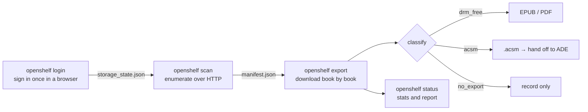
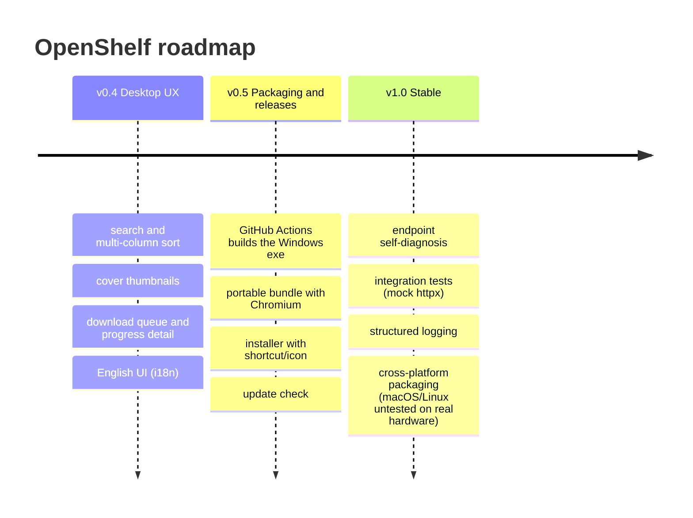

<div align="center">

# 📚 OpenShelf

**Enumerate and batch-export the ebooks you purchased on Google Play Books**

DRM-free books → EPUB / PDF · DRM books → the official `.acsm` for Adobe Digital Editions · un-exportable ones are only recorded

[**English**](README.en.md) ｜ [繁體中文](README.md)

[](https://github.com/SanHsien/openshelf/actions/workflows/ci.yml)
[](https://www.python.org/)
[](https://playwright.dev/python/)
[-blue)](https://www.python-httpx.org/)
[]()
[]()
[](LICENSE)

</div>

---

> [!IMPORTANT]
> **This tool only does lawful exporting — it never breaks any protection.**
> An `.acsm` is just a fulfillment token; it does not contain the book's content. Adobe Digital Editions (ADE) is what downloads the book, binds it to your Adobe ID, and manages the DRM — the book stays encrypted throughout. OpenShelf does only two things with an `.acsm`: **download it** and **store it as-is**.
> **No ACSM parsing, no fulfilling outside ADE, no key extraction, no protection removal.** If what you want is "DRM stripping", this tool does not do it.

## ✨ Features

- 🔎 **One-click enumeration** of your whole Google Play Books library, auto-classifying each book's export status.
- 📥 **Three-way routing**: DRM-free → EPUB/PDF, DRM → official `.acsm`, un-exportable → record only.
- 🔐 **Never touches your credentials**: you sign in once in a real browser; the program only reuses the saved session.
- 🌐 **HTTP-first**: enumeration and downloads go through `httpx` backend endpoints, not fragile page DOM.
- 🧾 **manifest as the single source of truth**: resume, skip already-downloaded, produce reports.
- ♻️ **Re-runnable**: interrupt it and run again — it picks up where it left off instead of re-downloading.
- 🖥️ **Desktop GUI** with search, covers, a download queue with ETA, retry-failed, CSV/HTML export, and **English/Chinese UI**.

## 🖼️ Screenshot


> The screenshot uses demo data only. It does not include a real Google account, library, or downloaded content.

## 📑 Table of contents

- [Boundary & disclaimer](#-boundary--disclaimer)
- [Screenshot](#️-screenshot)
- [How it works](#-how-it-works)
- [Quick start](#-quick-start)
- [Commands](#-commands)
- [Reading `.acsm` with ADE](#-reading-acsm-with-ade)
- [Configuration](#️-configuration)
- [Output & manifest](#-output--manifest)
- [Project layout](#️-project-layout)
- [Tests](#-tests)
- [Roadmap](#️-roadmap)
- [FAQ](#-faq)
- [Packaging to .exe](#-packaging-to-exe-pyinstaller)
- [Limitations & notes](#️-limitations--notes)
- [Third-party tooling background](#-third-party-tooling-background)
- [License & copyright](#-license--copyright)

## 🧱 Boundary & disclaimer

| Does ✅ | Does not ❌ |
|---|---|
| Download the official export files of books you own | Parse `.acsm` content |
| Save DRM-free books as EPUB/PDF | Fulfill outside ADE / extract the EPUB |
| Download the `.acsm` and store it as-is for ADE | Extract Adobe ADEPT keys |
| Classify, record, and skip un-exportable books | Remove or break any DRM/protection |

> Automating a signed-in Google service may conflict with its Terms of Service; assess and accept that risk yourself. This tool is only for exporting books **you lawfully own**.

## 🧭 How it works

OpenShelf is **HTTP-first**: the browser is used **only for a one-time sign-in** (Google blocks scripted credential login, so manual sign-in is the most robust). After the session is saved locally, **enumeration and downloads call the same Play Books web-version backend endpoints via `httpx`**, not page DOM/button selectors — the DOM is what breaks first when a site changes.



**Classification rules:**

| Library offers | Category | Action |
|---|---|---|
| EPUB / PDF | `drm_free` | Download the file, verify extension + size |
| ACSM only | `acsm` | Download the `.acsm`, store as-is |
| Nothing | `no_export` | Record only |
| Error | `failed` | Record the error, retry next time |

After downloading, files are verified by extension and size: an `.acsm` is only a few KB of XML, while EPUB/PDF are clearly larger. A mismatch is marked `failed` for retry.

> [!NOTE]
> **Endpoint isolation**: Play Books has no official "download a purchased book" API. Library enumeration uses the private `SyncUserLibrary` gRPC-Web RPC (authenticated with SAPISIDHASH); download URLs are embedded in the response — a direct link for DRM-free books, an `.acsm` fulfillment token for DRM books. This layer is isolated in `openshelf/playbooks.py`, so a Google backend change usually means editing that one file.

## 🚀 Quick start

**Requirements**: Python 3.11+, and a desktop GUI environment for the first sign-in.

```bash
git clone https://github.com/SanHsien/openshelf.git
cd openshelf
pip install -e .
```

> The first sign-in prefers your local Chrome / Edge. Only if you need to fall back to Playwright's bundled Chromium do you run `playwright install chromium`.

```bash
openshelf login     # 1) open a browser, sign in once
openshelf scan      # 2) enumerate the library, build the manifest
openshelf export    # 3) download the exportable books
openshelf status    # 4) see the stats
```

## 🧩 Commands

| Command | Description | Common options |
|---|---|---|
| `openshelf login` | Open a browser to sign in once and save the session | `--headless` |
| `openshelf scan` | Enumerate and classify the library over HTTP, write the manifest | |
| `openshelf export` | Download exportable books (EPUB/PDF or `.acsm`) | `--format pdf`, `--skip-acsm`, `--only`, `--limit`, `--refresh-acsm`, `--force-refresh-acsm`, `--skip-failed` |
| `openshelf status` | Show manifest stats and refresh the download report | |
| `openshelf report` | Write reports to the output folder (missing-books list / CSV / HTML) | `--format txt\|csv\|html\|all` |
| `openshelf doctor` | Endpoint health check: confirm Google's backend response shape still matches | |
| `openshelf acsm-open` | Batch-open downloaded `.acsm` with the default app | `--dry-run`, `--limit`, `--include-opened` |
| `openshelf acsm-report` | Write the ACSM handoff report without opening anything | |
| `openshelf ebook-open` | Batch-open downloaded DRM-free EPUB/PDF | `--target ade`, `--target default`, `--dry-run` |
| `openshelf ebook-report` | Write the EPUB/PDF handoff report without opening anything | `--target ade`, `--target default` |
| `openshelf calibre-import` | Import downloaded DRM-free EPUB/PDF into a Calibre library | `--library-path`, `--dry-run` |
| `openshelf calibre-report` | Write the Calibre handoff report without importing | |
| `openshelf ui` | Open the desktop GUI (needs `pip install -e '.[gui]'`) | |

```bash
openshelf export --format pdf            # prefer PDF for DRM-free books (falls back to EPUB)
openshelf export --skip-acsm             # DRM-free only; DRM books are recorded but no .acsm fetched
openshelf export --only acsm --limit 1   # smoke test: fetch the .acsm of a single DRM book
openshelf export --force-refresh-acsm --limit 25  # when ADE shows E_ADEPT_REQUEST_EXPIRED, re-fetch in batches
openshelf export --skip-failed           # stop retrying known failures (e.g. Google refuses the file)
openshelf acsm-open --dry-run            # list the .acsm that can be handed to ADE / the default app
openshelf acsm-open --limit 25           # open downloaded .acsm in batches
openshelf acsm-open --limit 25 --include-opened  # resend a previously sent batch after ADE failed
openshelf ebook-open --target ade --dry-run  # list the DRM-free EPUB/PDF that can go to ADE
openshelf ebook-open --target ade            # batch-open DRM-free EPUB/PDF with ADE
openshelf calibre-import --dry-run       # list what would be imported into Calibre
openshelf calibre-import                 # import downloaded DRM-free EPUB/PDF into Calibre
openshelf --config path/to/config.toml status   # use a specific config file
```

> Calibre handoff only processes `drm_free` EPUB/PDF that exist on disk; `.acsm` is never imported into Calibre and still needs ADE.

## 📖 Reading `.acsm` with ADE

A DRM book downloads as an `.acsm`, **not the book itself**. To read it (done on your own computer; the tool is not involved):

1. Install **Adobe Digital Editions 4.5** and authorize the machine with your Adobe ID.
2. Double-click the `.acsm` in `output/`, or run `openshelf acsm-open` to hand them off to the default app.
3. Read inside ADE. The book is protected by Adobe DRM and only opens on authorized ADE/devices.

If ADE shows `E_ADEPT_REQUEST_EXPIRED`, the `.acsm` fulfillment token has expired. Re-download the official `.acsm` first: in the desktop app, enable **Force re-fetch .acsm** and click Download; in the CLI, run `openshelf export --force-refresh-acsm`, then open the new `.acsm` with ADE.

Do not hand a large `.acsm` library to ADE all at once. ADE queues them, and later tokens may expire while waiting. Use batches instead:

1. Desktop app: set **Batch** to 20-30, enable **Force re-fetch .acsm**, click Download, then click Open ACSM. Wait for ADE to finish the batch and repeat.
2. CLI: run `openshelf export --force-refresh-acsm --limit 25`, then `openshelf acsm-open --limit 25`. Wait for ADE to finish the batch and repeat.
3. OpenShelf only records "handed off to ADE / the default app"; it cannot know whether ADE successfully imported the book. If ADE fails immediately, enable **Include sent** in the desktop app or pass `--include-opened` in the CLI to resend that batch.

`.acsm` re-fetch options:

| Option | CLI | Use case |
|---|---|---|
| **Re-fetch stale .acsm** | `openshelf export --refresh-acsm` | Re-download only `.acsm` files that OpenShelf considers stale based on download time + `acsm_valid_days`. Use this for routine cleanup. |
| **Force re-fetch .acsm** | `openshelf export --force-refresh-acsm` | Ignore validity days and re-download already-downloaded `.acsm` files that have not yet been handed off to ADE. Use this when ADE shows `E_ADEPT_REQUEST_EXPIRED`; pair it with `--limit 25` for batches. |

OpenShelf does not parse `.acsm`, so it does not know Adobe's actual fulfillment expiry; `acsm_valid_days` is only a reminder proxy.

## ⚙️ Configuration

Settings live in `config.toml` at the project root. Anything not listed falls back to the built-in default.

| Key | Default | Description |
|---|---|---|
| `output_dir` | `"output"` | Where ebooks and `.acsm` are stored |
| `profile_dir` | `".profile"` | Playwright persistent sign-in profile (do not commit) |
| `storage_state` | `"storage_state.json"` | Session snapshot with cookies (do not commit) |
| `prefer_format` | `"epub"` | Preferred format for DRM-free books, `epub` or `pdf` |
| `include_acsm` | `true` | Whether to fetch `.acsm` for DRM books |
| `throttle_seconds` | `2.0` | Delay between books (throttling) |
| `download_timeout` | `120` | Per-book download timeout, in seconds |
| `download_retries` | `3` | Download retry count (network errors / 5xx only) |
| `acsm_valid_days` | `7` | Days an `.acsm` is treated as valid (a proxy based on **download time**) |
| `calibredb_path` | `""` | Path to the Calibre CLI; empty means auto-detect `calibredb` and common install locations |
| `calibre_library` | `""` | Calibre library path; empty means use Calibre's default library |
| `ade_path` | `""` | Path to the ADE executable; empty means look in common install locations, then fall back to the default app |

## 📂 Output & manifest

- Ebooks and `.acsm` → `output/` (configurable in `config.toml`).
- `output/manifest.json` → per book: `volume_id`, title, author, publisher, category (`drm_free` / `acsm` / `no_export` / `failed`), download path and time. **Resume and skip are decided from this file** (machine-readable).
- `output/下載報表.txt` → the **human-readable report**, refreshed after scan/export/status, highlighting **missing books** (failed, no-export) and stale `.acsm`. Regenerate any time with `openshelf report`.
- `output/ACSM交接報表.txt` → the `.acsm` that can be opened with ADE / the default app, plus missing files.
- `output/EPUB-PDF交接報表.txt` → the DRM-free EPUB/PDF that can be handed to ADE / the default app, plus missing files.
- `output/Calibre交接報表.txt` → the DRM-free EPUB/PDF that can be imported into Calibre, missing files, and the `.acsm` that are deliberately not imported.
- `output/書庫清單.csv` / `output/書庫報表.html` → spreadsheet- and browser-friendly exports (`openshelf report`).

> `output/`, `.profile/`, and `storage_state.json` are git-ignored and never committed.

## 🗂️ Project layout

```
openshelf/
  cli.py        command entry point (login / scan / export / status / report / doctor / handoffs / ui)
  config.py     read config.toml + defaults
  browser.py    one-time Playwright sign-in, save storage_state (cookies)
  session.py    load storage_state into an authenticated httpx client
  playbooks.py  Play Books backend endpoints: enumerate, export options, resolve download URLs
  classify.py   drm_free / acsm / no_export decision
  export.py     HTTP download (EPUB/PDF and .acsm), naming, verification
  manifest.py   read/write the manifest (resume, skip, reports)
  acsm.py       ACSM handoff (batch-open .acsm with the default app)
  reader.py     EPUB/PDF handoff (DRM-free files to ADE or the default app)
  calibre.py    Calibre handoff (DRM-free EPUB/PDF only)
  service.py    scan / export orchestration shared by CLI and GUI; txt / csv / html reports
  logsetup.py   structured logging (output/openshelf.log)
  update.py     check GitHub Releases for a newer version (comparison only, never self-overwrites)
  ui/           desktop GUI (PySide6); i18n.py holds the English/Chinese strings
app.py          desktop entry point (for packaging)
assets/         app icons (openshelf.ico / .png; shared by the exe and the window)
openshelf.spec  PyInstaller build spec (one file, windowed, embedded icon)
build_exe.py    convenience script to build the executable locally
tools/          maintenance scripts (README demo screenshot, dependency freshness, Dependabot classification)
tests/          unit and integration tests (parsing, classification, naming, manifest, config, reports, ACSM staleness, i18n, dependency automation)
installer/      Inno Setup installer script (openshelf.iss)
docs/           screenshot workflow, third-party tooling background, per-version release notes
.github/        CI, Release, Dependabot and dependency-freshness workflows; issue / PR templates
config.toml     configuration file
pyproject.toml  package metadata and dependencies
```

## 🧪 Tests

No network, no browser, and no saved session required. Coverage includes library-response parsing, three-way classification, filename de-duplication and verification, manifest, config, reports, ACSM staleness, the English/Chinese UI strings, plus mock-`httpx` integration tests for pagination and classification and the dependency-maintenance tooling:

```bash
python -m unittest discover -s tests
```

CI runs the same suite on Python 3.11 / 3.12 / 3.13; all must pass.

The README main-window screenshot is generated from fixed demo data, never a real library:

```bash
python tools/generate_readme_screenshot.py
```

Details in [docs/screenshot-workflow.md](docs/screenshot-workflow.md) (written in Chinese).

## 🛣️ Roadmap

### ✅ Completed (M1–M11, currently v1.0.4)

- [x] **M1**: one-time browser sign-in + saved session (`browser.py` / `session.py`)
- [x] **M2**: endpoint discovery — SyncUserLibrary RPC + SAPISIDHASH auth, wired into `playbooks.py`
- [x] **M3**: three-way classification + `scan` writing the manifest
- [x] **M4**: HTTP download (direct EPUB/PDF, `.acsm` stored as-is) + naming + verification + resume + `status`
- [x] **M5**: throttling, download retry with backoff, friendly expired-session message, filename de-duplication for same-titled books, header verification, unit tests
- [x] **M6**: desktop UI shell (PySide6): book table, scan/download/stop, log, status bar (worker thread + signals)
- [x] **M7**: PyInstaller single-file packaging (`app.py` / `openshelf.spec` / `build_exe.py`; frozen paths and bundled Chromium handled)
- [x] **M8**: handoffs and public readiness — `.acsm` / EPUB·PDF / Calibre handoffs and reports, human-readable download report, `.acsm` staleness reminder, automatic library pagination, app icon and About box, Apache-2.0 license, GitHub Actions CI and contribution templates
- [x] **M9**: desktop UX (v0.4) — table search and remembered column widths, cover thumbnails, download queue with ETA, retry failed, CSV/HTML reports, English UI (i18n) and a bilingual README
- [x] **M10**: packaging and releases (v0.5) — CI builds the Windows exe and publishes a Release (lean / portable / installer, all with SHA256), update check, first-run tour, code-signing notes
- [x] **M11**: stable (v1.0) — endpoint self-diagnosis (`openshelf doctor`), mock-httpx integration tests (pagination / classification), structured logging (`output/openshelf.log`), cross-platform CI builds (macOS `.app` / Linux executable; non-Windows builds not yet tested on real hardware)

> Current state: **stable (v1.0.4)** — `login → scan → export` works end to end; three-way routing, download retries, three handoffs with reports, desktop GUI (search / covers / queue / bilingual UI / first-run tour / update check), batched ACSM handoff, endpoint self-diagnosis and structured logging, and Windows/macOS/Linux CI publishing. Windows release artifacts have been smoke-tested locally; macOS and Linux artifacts are CI-built only and have not been tested on those platforms. Test coverage spans parsing, classification, reports, ACSM staleness, i18n and the dependency tooling — see the CI run for the current count.

### 🗺️ Planned

> Everything below stays inside the project boundary. DRM circumvention, decryption, stripping, ACSM parsing, fulfilling outside ADE and key extraction will **never** be added (see "Never" below).



**v0.4 — Desktop UX** ✅ done
- [x] Table search box, sorting, remembered column widths
- [x] Cover thumbnails (from library metadata; no extra content fetched)
- [x] Download queue: current title, estimated time remaining, inline retry for failures
- [x] CSV / HTML report export
- [x] English UI (i18n) and a bilingual README

**v0.5 — Packaging and releases** ✅ done
- [x] **CI builds the Windows `.exe`** and publishes to GitHub Releases (tag-triggered, with SHA256)
- [x] **Portable bundle**: ships `ms-playwright/` Chromium inside `dist/` so users can unzip and run without `playwright install`
- [x] **Installer** (Inno Setup): Start-menu shortcut, desktop icon, uninstaller
- [x] **Update check**: compares against the latest GitHub Release and prompts (never self-overwrites)
- [x] Code-signing notes to reduce Windows SmartScreen warnings
- [x] First-run wizard: sign in → scan → download

**v1.0 — Stable** ✅ done
- [x] Endpoint health check / self-diagnosis (`openshelf doctor`): warns when Google's backend changes, centralized in `playbooks.py`
- [x] Integration tests (mock `httpx` responses) covering pagination, de-duplication, stop conditions and every category
- [x] Structured logging to file (`output/openshelf.log`) to make problem reports easier
- [x] Cross-platform packaging: CI produces `OpenShelf.app` on macOS and an executable on Linux (polished `.dmg` / AppImage packaging is optional future work); non-Windows builds are not yet tested on real hardware

### 🚫 Never

- DRM circumvention, decryption, stripping.
- Parsing `.acsm` content, fulfilling outside ADE, extracting Adobe ADEPT keys.
- Removing or breaking any ebook protection, or integrating third-party tools for that purpose.

> Issues and PRs heading in those directions will be declined. Background in [`docs/third-party-ebook-tooling.md`](docs/third-party-ebook-tooling.md) (written in Chinese).

## ❓ FAQ

<details>
<summary><b>Why does sign-in need a browser? Can't it just call an API?</b></summary>

Google aggressively blocks scripted credential login (CAPTCHA, 2FA, security blocks). Hand-rolling it is both fragile and a good way to get your account flagged. Signing in once yourself in a real browser and reusing the session is the most robust and the safest option. The program never handles your credentials.
</details>

<details>
<summary><b>Will OpenShelf strip DRM for me?</b></summary>

No, and it should not. DRM books only ever download the official `.acsm` for ADE, and the book stays encrypted throughout. This tool does not parse ACSM, extract keys, or remove protection.
</details>

<details>
<summary><b>Why are some books classified as <code>no_export</code>?</b></summary>

Not every book and not every region offers an export. Plenty of books can only be read inside the Play Books app; those have no downloadable file and are recorded as `no_export`.
</details>

<details>
<summary><b>What happens if I download an <code>.acsm</code> and never open it in ADE?</b></summary>

An `.acsm` generally has a fulfillment deadline and device-authorization limits, so it needs to be fulfilled in ADE reasonably soon; waiting too long or switching machines can invalidate it. That is decided by Adobe and the publisher, not by this tool.

If ADE shows `E_ADEPT_REQUEST_EXPIRED`, the token has expired. Re-fetch the official `.acsm`: enable **Force re-fetch .acsm** in the desktop app, or run `openshelf export --force-refresh-acsm`.
</details>

<details>
<summary><b>Will a Google change break it?</b></summary>

It might. That is true of every tool built on Google's non-public interfaces. OpenShelf keeps the volatile endpoints in `playbooks.py`, so a change usually means editing that one file.
</details>

## 📦 Packaging to .exe (PyInstaller)

> [!TIP]
> **Automated release (recommended)**: push a `v*` tag (e.g. `git tag v1.0.4 && git push origin v1.0.4`) and GitHub Actions builds on Windows and publishes to **Releases** with three bundles:
> - **Lean** `OpenShelf-<version>-windows-x64.zip` (exe only; sign-in uses your local Chrome/Edge)
> - **Portable** `OpenShelf-<version>-windows-x64-portable.zip` (exe + bundled Chromium, unzip and run)
> - **Installer** `OpenShelf-<version>-setup.exe` (Start-menu shortcut, optional desktop shortcut, uninstaller)
>
> All ship with a `.sha256` checksum. See [`.github/workflows/release.yml`](.github/workflows/release.yml) and [`installer/openshelf.iss`](installer/openshelf.iss).
>
> **Release notes**: before tagging, write the notes for that version to `docs/release-notes/<tag>.md` (e.g. `docs/release-notes/v1.0.4.md`). The workflow prefers that hand-written file and only falls back to `--generate-notes` when it is missing. Also confirm the version in `pyproject.toml` and `openshelf/__init__.py` matches the tag.

> [!NOTE]
> **About Windows SmartScreen**: an unsigned exe may be blocked on first run (choose "More info → Run anyway"). Removing the warning requires your own **code-signing certificate** (OV/EV), applied to `OpenShelf.exe` and the installer with `signtool sign /fd SHA256 /tr <timestamp server> /td SHA256 ...` after packaging. This project ships no certificate; if you need one, inject it into CI as a secret and add a signing step.

> [!IMPORTANT]
> PyInstaller **is not a cross-compiler**: producing a Windows `.exe` requires **building on Windows**; building on macOS/Linux yields that platform's executable. Every non-Windows CI artifact remains untested on real hardware.

Manually, on the target OS (Windows if you want the `.exe`):

```bash
pip install -e ".[gui,build]"
python build_exe.py              # equivalent to pyinstaller openshelf.spec --noconfirm
```

Artifacts land in `dist/` (single file, windowed, no console). The executable creates `output/`, `.profile/` and `storage_state.json` next to itself, not in system directories.

### How Chromium is bundled (important)

Sign-in prefers your local Chrome / Edge; a Chromium binary is only needed when falling back to Playwright's bundled browser. Chromium is **not** packed into the exe (browser binaries are large and independent of pip packages). `app.py` points `PLAYWRIGHT_BROWSERS_PATH` at an `ms-playwright/` folder **next to the exe**. If you want the bundled-Chromium fallback, pick one:

1. **Ship it with the exe (recommended for distribution)**: run `playwright install chromium` before packaging, then copy the `chromium-*` folder from your local Playwright browser cache into `dist/ms-playwright/` and distribute them together.
2. **Install on the user's machine**: run `playwright install chromium` once there and place the browser in `ms-playwright/` next to the exe (or set `PLAYWRIGHT_BROWSERS_PATH` to the same location).

> Downloading (`httpx`) and enumeration need no browser at all; Chromium is only used by `login`.

## ⚠️ Limitations & notes

- DRM books only download the official `.acsm` for ADE; **no ACSM parsing, no key extraction, no protection removal**.
- **`.acsm` validity**: an `.acsm` has a fulfillment deadline and device-authorization limits, so **download in batches and open them in ADE promptly**. OpenShelf uses "**the time we downloaded the `.acsm`** + `acsm_valid_days`" as a staleness proxy: stale entries are flagged by `status` and can be re-fetched with `openshelf export --refresh-acsm`.
  > ⚠️ The tool **does not read the real expiry embedded in the `.acsm`** (that would require parsing ACSM content, which crosses the project boundary). The staleness above is only a reminder estimated from download time, not Adobe's actual expiry.
- **Same-titled books**: when title + author collide, filenames are distinguished by "publication year · publisher"; if those match too, the `volume_id` is appended so files never overwrite each other.
- **Library pagination**: enumeration pages automatically until the library is complete (following the reported total and cursor); the page size cap is 400 books.
- Not every book or region offers an export; those are recorded as `no_export`.
- Automating a signed-in Google service may conflict with its Terms of Service — assess that yourself.
- When Google's library backend changes, the endpoints in `playbooks.py` need updating.

## 🧰 Third-party tooling background

Notes on ADE, Calibre, Epubor-style tools and where OpenShelf draws the line are collected in [`docs/third-party-ebook-tooling.md`](docs/third-party-ebook-tooling.md) (written in Chinese).

## 📝 License & copyright

**[Apache License 2.0](LICENSE).** You may use, modify, and distribute (including commercially), provided you keep the copyright notice and the attribution in [`NOTICE`](NOTICE.md) and follow the license terms. Provided without warranty of any kind.

| Item | Detail |
|------|--------|
| License | [Apache License 2.0](LICENSE) |
| Copyright | © 2026 SanHsien |
| Contact | sanhsien@pm.me |
| Fair use | Only for exporting the ebooks **you lawfully own**; no ACSM parsing, no key extraction, no protection removal |
| Warranty | Provided "AS IS" with no warranty; all risk and legal responsibility rests with the user |
| Notice | [`NOTICE.md`](NOTICE.md) |

---

<div align="center">
Only for exporting the ebooks you <b>lawfully own</b>. No ACSM parsing, no key extraction, no protection removal. Please respect copyright and each service's terms.
</div>
