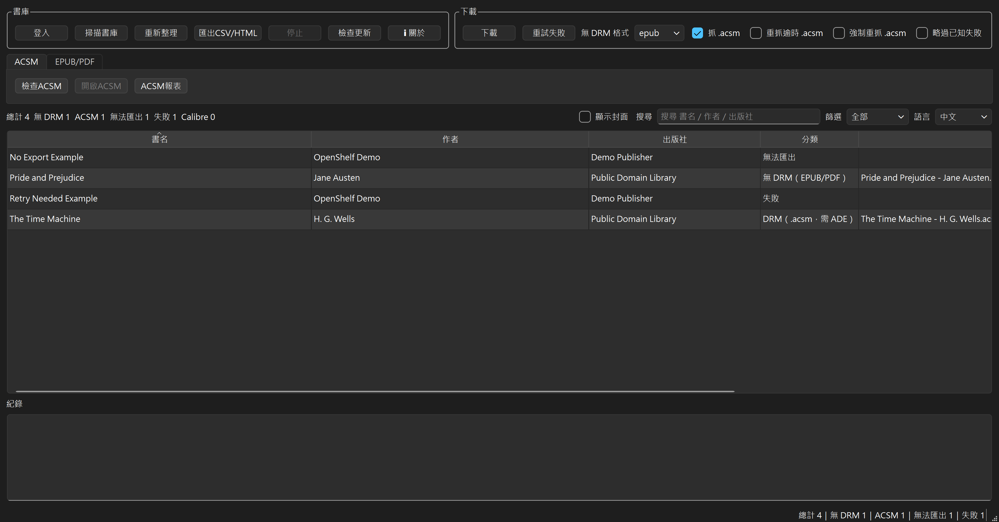
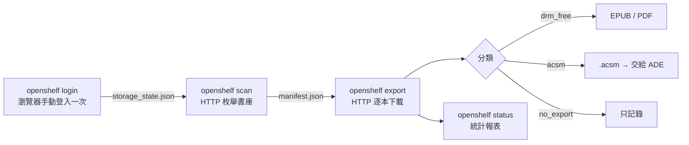
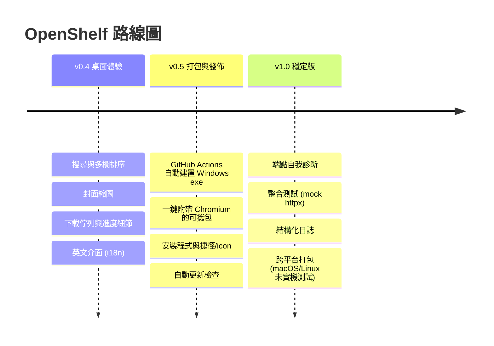

<div align="center">

# 📚 OpenShelf

**枚舉並批次匯出你在 Google Play 圖書購買的電子書**

無 DRM 書下載 EPUB / PDF · DRM 書下載官方 `.acsm` 供 Adobe Digital Editions 閱讀 · 無法匯出的只記錄

**繁體中文** ｜ [English](README.en.md)

[](https://github.com/SanHsien/openshelf/actions/workflows/ci.yml)
[](https://www.python.org/)
[](https://playwright.dev/python/)
[-blue)](https://www.python-httpx.org/)
[]()
[]()
[](LICENSE)

</div>

---

> [!IMPORTANT]
> **本工具只做合法匯出，不破解任何保護。**
> `.acsm` 只是一張領取憑證，不含書的內容；真正下載書、綁定 Adobe ID、管理 DRM 的是 ADE，書全程保持加密。OpenShelf 對 `.acsm` 只做兩件事：**下載**、**原樣存檔**。
> **不解析 ACSM、不在 ADE 之外 fulfill、不抽金鑰、不移除任何保護。** 要的若是「脫殼／解 DRM」，本工具不做。

## ✨ 特色

- 🔎 **一鍵枚舉**整個 Google Play 圖書庫，自動分類每本書的可匯出狀態。
- 📥 **三態分流**：無 DRM 抓 EPUB/PDF、DRM 抓官方 `.acsm`、無法匯出的只留紀錄。
- 🔐 **不碰你的帳密**：登入由你在真實瀏覽器手動完成一次，程式只沿用登入態。
- 🌐 **HTTP-first**：枚舉與下載走 `httpx` 後端端點，不依賴脆弱的頁面 DOM。
- 🧾 **manifest 為單一事實來源**：續傳、跳過已下載、產出統計報表。
- ♻️ **可重複執行**：中斷後再跑會自動接續，不重抓。
- 🖥️ **桌面介面**：搜尋、封面縮圖、下載佇列與預估剩餘時間、重試失敗、CSV/HTML 匯出、**中／英文介面**。

## 🖼️ 畫面截圖



> 截圖使用示範資料，不含真實 Google 帳號、書庫或下載內容。

## 📑 目錄

- [重要邊界與聲明](#-重要邊界與聲明)
- [畫面截圖](#️-畫面截圖)
- [運作原理](#-運作原理)
- [快速開始](#-快速開始)
- [指令](#-指令)
- [用 ADE 閱讀 `.acsm`](#-用-ade-閱讀-acsm)
- [設定](#️-設定)
- [輸出與 manifest](#-輸出與-manifest)
- [專案結構](#️-專案結構)
- [開發路線](#️-開發路線)
- [常見問題](#-常見問題)
- [限制與注意](#-限制與注意)
- [第三方工具背景](#-第三方工具背景)
- [授權與版權](#-授權與版權)

## 🧱 重要邊界與聲明

| 做 ✅ | 不做 ❌ |
|---|---|
| 自動下載你已購書的官方匯出檔 | 解析 `.acsm` 內容 |
| 無 DRM 書存成 EPUB/PDF | 在 ADE 之外自行 fulfill、抽 EPUB |
| DRM 書下載 `.acsm`，原樣存檔交給 ADE | 抽取 Adobe ADEPT 金鑰 |
| 分類、記錄、跳過無法匯出的書 | 移除或破壞任何 DRM／保護措施 |

> 自動化操作已登入的 Google 服務可能牴觸其服務條款，請自行評估與承擔。本工具僅供你匯出**自己合法擁有**的書。

## 🧭 運作原理

採 **HTTP-first**：瀏覽器**只負責一次性登入**（Google 不允許腳本帶帳密登入，手動登入最穩），登入態存到本機後，**枚舉書庫與下載都改用 `httpx` 直接呼叫 Play Books 網頁版同款後端端點**，不依賴頁面 DOM／按鈕選擇器（DOM 最容易隨改版壞）。



**分類規則**：

| 書庫可匯出 | 分類 | 動作 |
|---|---|---|
| 有 EPUB / PDF | `drm_free` | 下載書檔，副檔名 + 檔案大小覆核 |
| 只有 ACSM | `acsm` | 下載 `.acsm`，原樣存檔 |
| 無任何匯出 | `no_export` | 只記錄 |
| 流程出錯 | `failed` | 記錄錯誤，下次重試 |

下載後再以副檔名與檔案大小覆核：`.acsm` 只有幾 KB（XML），EPUB/PDF 明顯較大；不符就標 `failed` 待重試。

> [!NOTE]
> **端點隔離**：Play Books 沒有官方的「下載已購書」API。書庫枚舉走私有的 `SyncUserLibrary` gRPC-Web RPC（以 SAPISIDHASH 認證），下載 URL 一併內含於回應；無 DRM 書是直抓連結，DRM 書是 `.acsm` 領取憑證。這層全部隔離在 `openshelf/playbooks.py`，Google 後端改版時只需改這一個檔。

## 🚀 快速開始

**需求**：Python 3.11+、可開圖形視窗的環境（首次登入用）。

```bash
git clone https://github.com/SanHsien/openshelf.git
cd openshelf
pip install -e .
```

> 首次登入會優先使用本機 Chrome / Edge。只有你要退回 Playwright 內建 Chromium，才需要另外執行 `playwright install chromium`。

```bash
openshelf login     # 1) 開瀏覽器，手動登入一次
openshelf scan      # 2) 枚舉書庫、建立 manifest
openshelf export    # 3) 下載可匯出的書
openshelf status    # 4) 看統計
```

## 🧩 指令

| 指令 | 說明 | 常用選項 |
|---|---|---|
| `openshelf login` | 開瀏覽器手動登入一次，保存登入態 | `--headless` |
| `openshelf scan` | 以 HTTP 枚舉書庫並分類，寫入 manifest | |
| `openshelf export` | 以 HTTP 下載可匯出的書（EPUB/PDF 或 `.acsm`） | `--format pdf`、`--skip-acsm`、`--only`、`--limit`、`--refresh-acsm`、`--force-refresh-acsm`、`--skip-failed` |
| `openshelf status` | 顯示 manifest 統計，並更新下載報表 | |
| `openshelf report` | 在輸出目錄產生報表（缺漏清單／CSV／HTML） | `--format txt\|csv\|html\|all` |
| `openshelf doctor` | 端點健康檢查：確認 Google 後端回應結構仍符合預期 | |
| `openshelf acsm-open` | 批次用系統預設程式開啟已下載的 `.acsm` | `--dry-run` |
| `openshelf acsm-report` | 產生 ACSM 交接報表，不開啟檔案 | |
| `openshelf ebook-open` | 批次開啟已下載的無 DRM EPUB/PDF | `--target ade`、`--target default`、`--dry-run` |
| `openshelf ebook-report` | 產生 EPUB/PDF 交接報表，不開啟檔案 | `--target ade`、`--target default` |
| `openshelf calibre-import` | 把已下載的無 DRM EPUB/PDF 匯入 Calibre 書庫 | `--library-path`、`--dry-run` |
| `openshelf calibre-report` | 產生 Calibre 交接報表，不執行匯入 | |
| `openshelf ui` | 開啟桌面圖形介面（需 `pip install -e '.[gui]'`） | |

```bash
openshelf export --format pdf            # 無 DRM 書偏好 PDF（無 PDF 時退回 EPUB）
openshelf export --skip-acsm             # 只下載無 DRM 書，DRM 書僅記錄不抓 .acsm
openshelf export --only acsm --limit 1   # 測試用：只抓 1 本 DRM 書的 .acsm
openshelf export --force-refresh-acsm    # ADE 顯示 E_ADEPT_REQUEST_EXPIRED 時，重抓所有 .acsm
openshelf export --skip-failed           # 不再重試已知失敗（如 Google 端不給檔者）
openshelf acsm-open --dry-run            # 檢查可交接 ADE / 系統預設程式的 .acsm
openshelf acsm-open                      # 批次開啟已下載的 .acsm
openshelf ebook-open --target ade --dry-run  # 檢查可交接 ADE 的無 DRM EPUB/PDF
openshelf ebook-open --target ade            # 批次用 ADE 開啟無 DRM EPUB/PDF
openshelf calibre-import --dry-run       # 檢查可匯入 Calibre 的無 DRM 檔案
openshelf calibre-import                 # 匯入已下載的無 DRM EPUB/PDF 到 Calibre
openshelf --config path/to/config.toml status   # 指定設定檔
```

> Calibre 交接只處理 manifest 中 `drm_free` 且檔案存在的 EPUB/PDF；`.acsm` 不會匯入 Calibre，仍需用 ADE 開啟。

## 📖 用 ADE 閱讀 `.acsm`

DRM 書下載到的是 `.acsm`，**不是書本身**。閱讀步驟（在你自己的電腦上完成，本工具不介入）：

1. 安裝 **Adobe Digital Editions 4.5**，用你的 Adobe ID 授權這台電腦。
2. 雙擊 `output/` 裡的 `.acsm`，或執行 `openshelf acsm-open` 批次交接給系統預設程式。
3. 之後在 ADE 內閱讀。書受 Adobe DRM 保護，僅能在已授權的 ADE／裝置上開啟。

若 ADE 顯示 `E_ADEPT_REQUEST_EXPIRED`，代表這批 `.acsm` 領取憑證已失效。請先在 OpenShelf 重新下載官方 `.acsm`：桌面版勾選 **強制重抓 .acsm** 後按「下載」，或 CLI 執行 `openshelf export --force-refresh-acsm`，再重新用 ADE 開啟。

## ⚙️ 設定

設定寫在專案根目錄的 `config.toml`；未列出的項目使用內建預設值。

| 鍵 | 預設 | 說明 |
|---|---|---|
| `output_dir` | `"output"` | 電子書與 `.acsm` 存放目錄 |
| `profile_dir` | `".profile"` | Playwright 持久化登入 profile（勿提交） |
| `storage_state` | `"storage_state.json"` | 登入態快照（cookies，勿提交） |
| `prefer_format` | `"epub"` | 無 DRM 書偏好格式，`epub` 或 `pdf` |
| `include_acsm` | `true` | 是否抓 DRM 書的 `.acsm` |
| `throttle_seconds` | `2.0` | 每本之間間隔秒數（節流） |
| `download_timeout` | `120` | 單本下載逾時秒數 |
| `download_retries` | `3` | 下載失敗重試次數（網路錯誤／5xx 才重試） |
| `acsm_valid_days` | `7` | `.acsm` 視為有效的天數（以**下載時間**為準的時效代理） |
| `calibredb_path` | `""` | Calibre CLI 路徑；留空時自動找 `calibredb` 與常見安裝位置 |
| `calibre_library` | `""` | Calibre 書庫路徑；留空時使用 Calibre 預設書庫 |
| `ade_path` | `""` | ADE 執行檔路徑；留空時找常見安裝位置，找不到則使用系統預設程式 |

## 📂 輸出與 manifest

- 電子書與 `.acsm` → `output/`（預設，可在 `config.toml` 調整）。
- `output/manifest.json` → 每本書的 `volume_id`、書名、作者、出版社、分類（`drm_free` / `acsm` / `no_export` / `failed`）、下載路徑、時間。**續傳與跳過都依此判斷**（機器讀）。
- `output/下載報表.txt` → **人看得懂的報表**，scan／export／status 後自動更新，重點列出**缺漏的書**（失敗、無法匯出）與逾時的 `.acsm`。也可隨時 `openshelf report` 重產。
- `output/ACSM交接報表.txt` → 列出可用 ADE / 系統預設程式開啟的 `.acsm`，以及檔案遺失項目。
- `output/EPUB-PDF交接報表.txt` → 列出可交接 ADE / 系統預設程式的無 DRM EPUB/PDF，以及檔案遺失項目。
- `output/Calibre交接報表.txt` → 列出可匯入 Calibre 的無 DRM EPUB/PDF、檔案遺失項目，以及不匯入的 `.acsm`。

> `output/`、`.profile/`、`storage_state.json` 皆已列入 `.gitignore`，不會進版控。

## 🗂️ 專案結構

```
openshelf/
  cli.py        指令進入點（login / scan / export / status / report / doctor / 交接 / ui）
  config.py     讀取 config.toml + 預設值
  browser.py    Playwright 一次性登入、保存 storage_state（cookies）
  session.py    把 storage_state 載入成帶登入態的 httpx client
  playbooks.py  Play Books 後端端點：枚舉書庫、取得匯出選項、解析下載 URL
  classify.py   drm_free / acsm / no_export 判斷
  export.py     HTTP 下載（EPUB/PDF 與 .acsm）、命名、覆核
  manifest.py   讀寫 manifest（續傳、跳過、報表）
  acsm.py       ACSM 交接（批次用系統預設程式開啟 .acsm）
  reader.py     EPUB/PDF 交接（無 DRM 檔案可交給 ADE 或系統預設程式）
  calibre.py    Calibre 交接（只匯入無 DRM EPUB/PDF）
  service.py    scan / export 協調邏輯（CLI 與 GUI 共用）；報表 txt / csv / html
  logsetup.py   結構化日誌（output/openshelf.log）
  update.py     檢查 GitHub Releases 是否有新版（純比對，不自動覆寫）
  ui/           桌面圖形介面（PySide6）；i18n.py 中英介面字串
app.py          桌面應用進入點（供打包）
assets/         應用圖示（openshelf.ico／.png；exe 與視窗 icon 共用）
openshelf.spec  PyInstaller 打包設定（單檔、視窗模式、內嵌 icon）
build_exe.py    在本機建置執行檔的便捷腳本
tests/          單元測試（解析／分類／命名／manifest／設定）
config.toml     設定檔
pyproject.toml  套件與相依
```

## 🧪 測試

不需網路，純函式單元測試（解析書庫回應、三態分類、檔名去重與覆核、manifest、設定）：

```bash
python -m unittest discover -s tests
```

## 🛣️ 開發路線

### ✅ 已完成（M1–M11，目前 v1.0.2）

- [x] **M1**：瀏覽器一次性登入 + 保存登入態（`browser.py` / `session.py`）
- [x] **M2**：端點探勘——SyncUserLibrary RPC + SAPISIDHASH 認證，填入 `playbooks.py`
- [x] **M3**：三態分類 + `scan` 寫入 manifest
- [x] **M4**：HTTP 下載（EPUB/PDF 直抓、`.acsm` 原樣存檔）+ 檔名 + 覆核 + 續傳 + `status`
- [x] **M5**：節流、下載重試＋退避、認證過期友善提示、同名書檔名去重、檔頭覆核、單元測試
- [x] **M6**：桌面 UI 殼（PySide6）：書單表格、掃描／下載／停止、log、狀態列（背景執行緒 + 訊號）
- [x] **M7**：PyInstaller 打包單一執行檔（`app.py` / `openshelf.spec` / `build_exe.py`；frozen 路徑與 Chromium 攜帶已處理）
- [x] **M8**：交接與公開整備——`.acsm` / EPUB·PDF / Calibre 三種交接與報表、人可讀下載報表、`.acsm` 時效提醒、書庫自動分頁、應用圖示與「關於」、Apache-2.0 授權、GitHub Actions CI 與貢獻範本
- [x] **M9**：桌面體驗（v0.4）——表格搜尋與記住欄寬、封面縮圖、下載佇列與預計剩餘時間、重試失敗、CSV/HTML 報表、中英介面（i18n）與雙語 README
- [x] **M10**：打包與發佈（v0.5）——CI 自動建置 Windows exe 並發佈 Release（精簡／可攜／安裝程式三種包 + SHA256）、自動更新檢查、首次啟動導覽、程式碼簽章說明
- [x] **M11**：穩定版（v1.0）——端點自我診斷（`openshelf doctor`）、mock httpx 整合測試（分頁／分類）、結構化日誌（`output/openshelf.log`）、跨平台 CI 建置（macOS `.app`／Linux 執行檔；非 Windows 版本尚未實機測試）

> 目前進度：**穩定版（v1.0.2）**——`login → scan → export` 全線打通；三態分流、下載重試、三種交接與報表、桌面 GUI（搜尋／封面／佇列／中英介面／導覽／檢查更新）、端點自我診斷與結構化日誌、Windows/macOS/Linux CI 自動發佈。Windows Release 產物已本機啟動／安裝測試；macOS/Linux 產物目前僅由 CI 建置，尚未在對應系統實機測試。共 95 個單元／整合測試。

### 🗺️ 發展路線圖（規劃中）

> 以下皆在專案邊界內推進；**永遠不會**加入 DRM 規避／解密／脫殼、ACSM 解析、ADE 外 fulfill、金鑰抽取（見下方「永不做」）。



**v0.4 — 桌面體驗** ✅ 已完成
- [x] 表格搜尋框與排序、記住欄寬
- [x] 書籍封面縮圖（來自書庫 metadata，不另抓內容）
- [x] 下載佇列視覺化：目前書名、預計剩餘時間、失敗即時重試鈕
- [x] 報表可匯出 CSV／HTML
- [x] 介面英文化（i18n），README 雙語

**v0.5 — 打包與發佈（exe 強化重點）** ✅ 已完成
- [x] **CI 自動建置 Windows `.exe`** 並發佈到 GitHub Releases（tag 觸發、附 SHA256）
- [x] **可攜整合包**：一鍵把 `ms-playwright/` Chromium 附進 `dist/`，使用者解壓即用、免再 `playwright install`
- [x] **安裝程式**（Inno Setup）：開始功能表捷徑、桌面 icon、解除安裝
- [x] **自動更新檢查**：比對 GitHub Releases 最新版，提示下載（不自動覆寫）
- [x] 程式碼簽章說明，降低 Windows SmartScreen 警告
- [x] 首次啟動精靈：引導 登入 → 掃描 → 下載

**v1.0 — 穩定版** ✅ 已完成
- [x] 端點健康檢查／自我診斷（`openshelf doctor`）：Google 後端改版時主動提示，集中於 `playbooks.py`
- [x] 整合測試（mock `httpx` 回應），涵蓋分頁、去重、停止條件與各分類
- [x] 結構化日誌與輸出到檔（`output/openshelf.log`），方便回報問題
- [x] 跨平台打包：CI 於 macOS 產出 `OpenShelf.app`、Linux 產出執行檔（`.dmg`／AppImage 之精緻封裝為後續選配）；非 Windows 版本尚未實機測試

### 🚫 永遠不會做（邊界）

- DRM 規避、解密、脫殼。
- 解析 `.acsm` 內容、在 ADE 之外 fulfill、抽取 Adobe ADEPT／金鑰。
- 移除或破壞任何電子書的保護措施，或整合這類第三方工具。

> 任何 issue／PR 若往上述方向走，會被婉拒。背景見 [`docs/third-party-ebook-tooling.md`](docs/third-party-ebook-tooling.md)。

## ❓ 常見問題

<details>
<summary><b>為什麼登入還要開瀏覽器？不能直接打 API 嗎？</b></summary>

Google 對「腳本帶帳密登入」有強力封鎖（CAPTCHA、二階段驗證、安全阻擋），硬刻又脆弱又可能害帳號被風控。讓你在真實瀏覽器手動登入一次、之後沿用登入態，是最穩也最安全的做法。程式全程不經手帳密。
</details>

<details>
<summary><b>OpenShelf 會幫我解開 DRM 嗎？</b></summary>

不會，也不該。DRM 書只會下載官方 `.acsm` 供 ADE 閱讀，書全程保持加密。本工具不解析 ACSM、不抽金鑰、不移除保護。
</details>

<details>
<summary><b>為什麼有些書被歸為 <code>no_export</code>？</b></summary>

並非每本書、每個地區都提供匯出。不少書只能留在 Play Books App 內閱讀，這類沒有任何可下載的檔案，會被記錄為 `no_export`。
</details>

<details>
<summary><b><code>.acsm</code> 下載後一直沒用 ADE 開，會怎樣？</b></summary>

`.acsm` 通常有領取時效／裝置授權限制，需及時用 ADE fulfill；逾時或換機可能失效。這由 Adobe／出版商決定，非本工具可控。

若 ADE 顯示 `E_ADEPT_REQUEST_EXPIRED`，代表憑證已失效。請重抓官方 `.acsm`：桌面版勾選 **強制重抓 .acsm** 後按「下載」，或 CLI 執行 `openshelf export --force-refresh-acsm`。
</details>

<details>
<summary><b>Google 改版會不會壞掉？</b></summary>

可能會。所有依賴 Google 未公開介面的工具都一樣。OpenShelf 把易變的端點集中在 `playbooks.py`，改版時通常只需改這一個檔。
</details>

## 📦 打包成 .exe（PyInstaller）

> [!TIP]
> **自動發佈（推薦）**：推一個 `v*` 版本標籤（如 `git tag v0.4.0 && git push origin v0.4.0`），GitHub Actions 會在 Windows 上自動建置並發佈到 **Releases**，附三種包：
> - **精簡版** `OpenShelf-<版本>-windows-x64.zip`（只含 exe；登入用本機 Chrome/Edge）
> - **可攜版** `OpenShelf-<版本>-windows-x64-portable.zip`（exe + 內建 Chromium，解壓即用）
> - **安裝程式** `OpenShelf-<版本>-setup.exe`（開始功能表捷徑、可選桌面捷徑、可解除安裝）
>
> 皆附 `.sha256` 校驗檔。流程見 [`.github/workflows/release.yml`](.github/workflows/release.yml)、安裝腳本見 [`installer/openshelf.iss`](installer/openshelf.iss)。

> [!NOTE]
> **關於 Windows SmartScreen**：未經程式碼簽章的 exe 首次執行可能被 SmartScreen 攔下（按「更多資訊 → 仍要執行」即可）。要消除警告需自備**程式碼簽章憑證**（OV/EV code signing），在打包後對 `OpenShelf.exe` 與安裝程式 `signtool sign /fd SHA256 /tr <時間戳伺服器> /td SHA256 ...`。本專案不內含憑證；如需，於 CI 以 secret 注入憑證再加一個簽章步驟。

> [!IMPORTANT]
> PyInstaller **不是跨平台編譯器**：要產出 Windows `.exe`，必須**在 Windows 上**執行打包；在 macOS／Linux 上打包只會得到該平台的執行檔。目前除 Windows 外之 CI 編譯產物均尚未實機測試。

手動在目標作業系統（要 `.exe` 就用 Windows）上：

```bash
pip install -e ".[gui,build]"
python build_exe.py              # 等同 pyinstaller openshelf.spec --noconfirm
```

產物在 `dist/`（單檔、視窗模式，無主控台）。執行檔旁會自動建立 `output/`、`.profile/`、`storage_state.json`（打包後這些都落在 exe 同目錄，不寫進系統目錄）。

### Chromium 怎麼帶（重要）

登入會優先使用本機 Chrome / Edge；只有退回 Playwright 內建 Chromium 時才需要 Chromium 瀏覽器檔。Chromium **不會被打進 exe**（瀏覽器二進位龐大且獨立於 pip 套件）。`app.py` 已將 `PLAYWRIGHT_BROWSERS_PATH` 指向 **exe 旁的 `ms-playwright/`**，若你需要內建 Chromium fallback，請二擇一：

1. **隨 exe 攜帶（推薦給散布）**：打包前先 `playwright install chromium`，把本機 Playwright 瀏覽器快取中的 `chromium-*` 資料夾複製到 `dist/ms-playwright/`，與 exe 一起散布。
2. **使用者端首次安裝**：在使用者機器上跑一次 `playwright install chromium`，並把瀏覽器放到 exe 旁的 `ms-playwright/`（或設定相同的 `PLAYWRIGHT_BROWSERS_PATH` 環境變數）。

> 下載（`httpx`）與枚舉不需瀏覽器；Chromium 只在 `登入` 時用到。

## ⚠️ 限制與注意

- DRM 書只下載官方 `.acsm` 供 ADE 閱讀；**不解析 ACSM、不抽金鑰、不移除保護**。
- **`.acsm` 時效**：`.acsm` 有領取時效／裝置授權限制，建議**分批下載、隨即用 ADE 開**。本工具以「**我們下載該 `.acsm` 的時間** + `acsm_valid_days`」當時效代理：逾期會在 `status` 標示並可 `openshelf export --refresh-acsm` 重抓。
  > ⚠️ 本工具**不讀取 `.acsm` 內含的真正到期時間**（那需要解析 ACSM 內容，違反本專案邊界）；上述時效僅為以下載時間估算的提醒，非 Adobe 憑證的實際到期。
- **同名書辨識**：同書名（書名+作者）多本時，檔名以「出版年 · 出版社」區別；仍相同才補 `volume_id`，避免互相覆蓋。
- **書庫分頁**：枚舉會自動分頁直到取齊（依回應的總數與游標）；單頁上限 400 本。
- 並非每本書、每個地區都提供匯出，無法匯出者歸為 `no_export`。
- 自動化操作已登入的 Google 服務可能牴觸其服務條款，請自行評估。
- Google 書庫後端改版時，`playbooks.py` 的端點需更新。

## 🧰 第三方工具背景

關於 ADE、Calibre、Epubor 類工具與 OpenShelf 邊界，整理在
[`docs/third-party-ebook-tooling.md`](docs/third-party-ebook-tooling.md)。

## 📝 授權與版權

**[Apache License 2.0](LICENSE)。** 你可以自由使用、修改與散布（含商用），惟須保留著作權聲明與 [`NOTICE`](NOTICE.md) 中的歸屬聲明，並依授權條款行事；本軟體不附帶任何擔保。

| 項目 | 內容 |
|------|------|
| 授權 | [Apache License 2.0](LICENSE) |
| 著作權 | Copyright © 2026 SanHsien |
| 聯絡信箱 | sanhsien@pm.me |
| 合理使用 | 僅供匯出**你自己合法擁有**之電子書；不解析 ACSM、不抽金鑰、不移除任何保護 |
| 擔保 | 按「現狀」（AS IS）提供，不提供任何擔保；使用風險與法律責任由使用者自行承擔 |
| 聲明 | [`NOTICE.md`](NOTICE.md) |

---

<div align="center">
僅供匯出你<b>自己合法擁有</b>的電子書。不解析 ACSM、不抽金鑰、不移除任何保護。請尊重著作權與各服務的使用條款。
</div>
