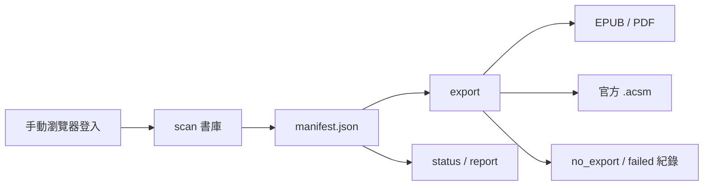

<div align="center">

# OpenShelf

**把你在 Google Play 圖書中可合法匯出的電子書，批次整理到自己的電腦。**

無 DRM 書下載 EPUB / PDF · DRM 書保存官方 `.acsm` 交給 Adobe Digital Editions · 無法匯出的只記錄

**繁體中文** ｜ [English](README.en.md)

[](https://github.com/SanHsien/openshelf/releases/latest)
[](https://github.com/SanHsien/openshelf/actions/workflows/ci.yml)
[](https://www.python.org/)
[](#平台支援)
[](LICENSE)

[下載最新版](https://github.com/SanHsien/openshelf/releases/latest) · [從原始碼執行](#從原始碼執行) · [開發與測試](#開發與測試)

</div>


OpenShelf 是一個本機執行的 Google Play 圖書匯出工具。你只需在瀏覽器手動登入一次；之後程式會枚舉自己的書庫、判斷每本書可否匯出，並把結果整理成可續傳的 manifest。

它的重點不是「破解電子書」，而是把 Google 本來就提供給你的官方匯出結果，從逐本操作改成可重複、可檢查、可批次執行的流程。

## 你可以做什麼

| 書籍狀態 | OpenShelf 的處理方式 |
|---|---|
| Google 提供 EPUB / PDF | 下載官方無 DRM 檔案 |
| Google 只提供 ACSM | 下載官方 `.acsm`，原樣交給 Adobe Digital Editions |
| Google 不提供任何匯出 | 記錄為 `no_export`，不嘗試繞過限制 |
| 下載或端點失敗 | 記錄為 `failed`，之後可重試 |

其他重點：

- **本機優先**：沒有 OpenShelf 雲端帳號，也不代管你的書庫或檔案。
- **不碰帳密**：登入在真實瀏覽器由你自己完成，程式只沿用登入態。
- **HTTP-first**：登入後的枚舉與下載走後端請求，不依賴容易改版的頁面按鈕與 DOM。
- **可續跑**：`manifest.json` 記錄狀態；中斷後重新執行不必全部重抓。
- **GUI + CLI**：一般使用者可用桌面介面；進階使用者可用 `openshelf` 指令。
- **報表與交接**：可產生 TXT / CSV / HTML 報表，並將 EPUB/PDF、ACSM 分別交給適合的閱讀工具。

## 下載與使用

### Windows：直接下載正式版

前往 [Latest Release](https://github.com/SanHsien/openshelf/releases/latest)。目前正式版提供 Windows 安裝程式與可攜包；每個主要發行檔都附 SHA-256 校驗檔。

第一次啟動後，照畫面完成：

1. **登入**：開啟瀏覽器並登入自己的 Google 帳號。
2. **掃描**：讀取 Google Play 圖書庫並建立清單。
3. **下載**：下載可匯出的 EPUB/PDF 或官方 `.acsm`。
4. **查看結果**：搜尋、重試失敗項目，或匯出報表。

> Windows 發行檔目前未做 Authenticode 程式碼簽章，SmartScreen 可能顯示未知發行者。請從本 repo 的 Release 下載並核對 SHA-256。

### 從原始碼執行

需求：Python 3.11+。

```bash
git clone https://github.com/SanHsien/openshelf.git
cd openshelf
pip install -e .
```

第一次使用：

```bash
openshelf login
openshelf scan
openshelf export
openshelf status
```

若要桌面介面：

```bash
pip install -e ".[gui]"
openshelf ui
```

登入會優先使用本機 Chrome / Edge；只有需要 Playwright 內建 Chromium fallback 時才需另外安裝 Chromium。

## 工作流程


```mermaid
flowchart LR
    A[手動瀏覽器登入] --> B[scan 書庫]
    B --> C[manifest.json]
    C --> D[export]
    D --> E[EPUB / PDF]
    D --> F[官方 .acsm]
    D --> G[no_export / failed 紀錄]
    C --> H[status / report]
```

Google Play Books 沒有公開的「下載已購書」API。OpenShelf 將目前使用的書庫端點集中隔離在 `openshelf/playbooks.py`；如果 Google 改版，主要需要維護的是這一層，而不是整個 GUI。

## 常用指令

| 指令 | 用途 |
|---|---|
| `openshelf login` | 手動登入並保存登入態 |
| `openshelf scan` | 枚舉書庫並更新 manifest |
| `openshelf export` | 下載可匯出的 EPUB/PDF 或 `.acsm` |
| `openshelf status` | 查看目前統計與狀態 |
| `openshelf report` | 產生 TXT / CSV / HTML 報表 |
| `openshelf doctor` | 檢查 Google 後端端點是否仍符合預期 |
| `openshelf acsm-open` | 將已下載的 `.acsm` 交給系統預設程式 / ADE |
| `openshelf ebook-open` | 開啟已下載的無 DRM EPUB/PDF |
| `openshelf calibre-import` | 將無 DRM EPUB/PDF 匯入 Calibre |
| `openshelf ui` | 開啟桌面介面 |

查看完整參數：

```bash
openshelf --help
openshelf export --help
```

幾個常見例子：

```bash
openshelf export --format pdf
openshelf export --skip-acsm
openshelf export --only acsm --limit 10
openshelf export --force-refresh-acsm
openshelf calibre-import --dry-run
```

## `.acsm` 與 DRM 邊界

> [!IMPORTANT]
> **OpenShelf 不破解 DRM。**

`.acsm` 是 Adobe Digital Editions 使用的領取憑證，不是電子書內容本身。OpenShelf 對 `.acsm` 只做兩件事：**下載**、**原樣保存／交接**。

OpenShelf **不會**：

- 解析 ACSM 內容以自行 fulfill；
- 抽取 Adobe ADEPT 或其他金鑰；
- 解密、脫殼或移除 DRM；
- 嘗試取得 Google 沒有提供匯出權限的書檔。

如果 ADE 顯示 `E_ADEPT_REQUEST_EXPIRED`，可重新下載官方 `.acsm`：

```bash
openshelf export --force-refresh-acsm
```

背景與第三方工具邊界見 [`docs/third-party-ebook-tooling.md`](docs/third-party-ebook-tooling.md)。

## 平台支援

| 平台 | 狀態 |
|---|---|
| Windows 10/11 x64 | **主要驗證平台**；提供安裝程式與可攜 Release |
| macOS | CI 會建置 `.app`，目前未宣稱完整實機驗收 |
| Linux x64 | CI 會建置執行檔，需桌面環境完成登入；目前未宣稱完整實機驗收 |

跨平台核心為 Python；GUI 使用 PySide6，登入使用瀏覽器 / Playwright，下載使用 `httpx`。

## 資料與隱私

OpenShelf 沒有後端服務。登入態、manifest、下載檔與 log 都保存在你的電腦上。

請注意：自動化操作已登入的 Google 服務可能受 Google 服務條款約束；本工具僅設計用於匯出**你自己合法擁有、且服務本身允許匯出**的電子書。

## 開發與測試

安裝開發環境後：

```bash
python -m unittest discover -s tests
```

CI 會在 GitHub Actions 執行測試；Release workflow 負責各平台建置與發行。版本資訊以 `pyproject.toml` 與 Release tag 為準。

維護相關文件：

- [`CONTRIBUTING.md`](CONTRIBUTING.md) — 貢獻與開發流程
- [`REPO_REVIEW.md`](REPO_REVIEW.md) — 專案檢視與後續改善紀錄
- [`docs/release-notes/`](docs/release-notes/) — 各版本發行說明
- [`docs/screenshot-workflow.md`](docs/screenshot-workflow.md) — README 截圖產生流程
- [`NOTICE.md`](NOTICE.md) — 第三方歸屬與聲明

## 授權

[Apache License 2.0](LICENSE)。Copyright © 2026 SanHsien。

本軟體按「現狀」提供，不附帶任何擔保。請尊重著作權、出版商限制與各服務條款。
